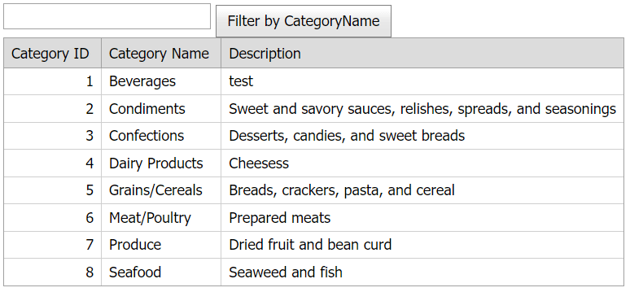

# GridView for ASP.NET Web Forms - How to apply a filter to a column on the server side
<!-- run online -->
**[[Run Online]](https://codecentral.devexpress.com/e3582/)**
<!-- run online end -->

This example demonstrates how to use a text string from the external text box to filter a grid column on the server.



## Overview

1. Create the [Grid View](https://docs.devexpress.com/AspNet/DevExpress.Web.ASPxGridView) control, populate it with columns, and bind it to a data source. Add a text box and a button. In a button's client-side [Click](https://docs.devexpress.com/AspNet/js-ASPxClientButton.Click) event handler, call the grid's [PerformCallback](https://docs.devexpress.com/AspNet/js-ASPxClientGridView.PerformCallback(args)) method to pass a text string from the text box to the server.

    ```aspx
    <dx:ASPxTextBox ID="txtFilter" runat="server" Width="170px" Style="display: inline-table" />
    <dx:ASPxButton ID="btnFilter" ClientInstanceName="btnFilter" runat="server" Text="Filter by CategoryName"
        AutoPostBack="false" ...>
        <ClientSideEvents Click="function(s, e) { grid.PerformCallback(); }" />
    </dx:ASPxButton>
    <dx:ASPxGridView ID="grid" ClientInstanceName="grid" runat="server" AutoGenerateColumns="False"
        DataSourceID="ds" KeyFieldName="CategoryID" OnCustomCallback="grid_CustomCallback">
        <Columns>
            <dx:GridViewDataTextColumn FieldName="CategoryID" ReadOnly="True" VisibleIndex="0">
                <EditFormSettings Visible="False" />
            </dx:GridViewDataTextColumn>
            <dx:GridViewDataTextColumn FieldName="CategoryName" VisibleIndex="1" />
            <dx:GridViewDataTextColumn FieldName="Description" VisibleIndex="2" />
        </Columns>
    </dx:ASPxGridView>
    <asp:AccessDataSource ID="ds" runat="server" DataFile="~/App_Data/nwind.mdb"
        SelectCommand="SELECT [CategoryID], [CategoryName], [Description] FROM [Categories]" />
    ```

2. Handle the grid's server-side [CustomCallback](https://docs.devexpress.com/AspNet/DevExpress.Web.ASPxGridView.CustomCallback) event. In the handler, filter a particular grid column by the text from the text box. To enable this behavior, call the [AutoFilterBy](https://docs.devexpress.com/AspNet/DevExpress.Web.GridViewDataColumn.AutoFilterBy(System.String)) method and use the text string as a parameter.

    ```csharp
    protected void grid_CustomCallback (object sender, ASPxGridViewCustomCallbackEventArgs e) {
        (grid.Columns["CategoryName"] as GridViewDataColumn).AutoFilterBy(txtFilter.Text);
    }
    ```

## Files to Review

* [Default.aspx](./CS/WebSite/Default.aspx) (VB: [Default.aspx](./VB/WebSite/Default.aspx))
* [Default.aspx.cs](./CS/WebSite/Default.aspx.cs) (VB: [Default.aspx.vb](./VB/WebSite/Default.aspx.vb))

## Documentation

* [AutoFilterBy](https://docs.devexpress.com/AspNet/DevExpress.Web.GridViewDataColumn.AutoFilterBy(System.String))
